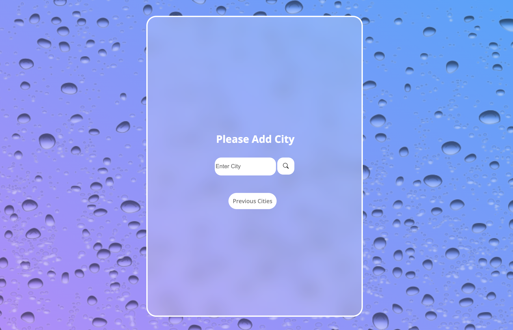
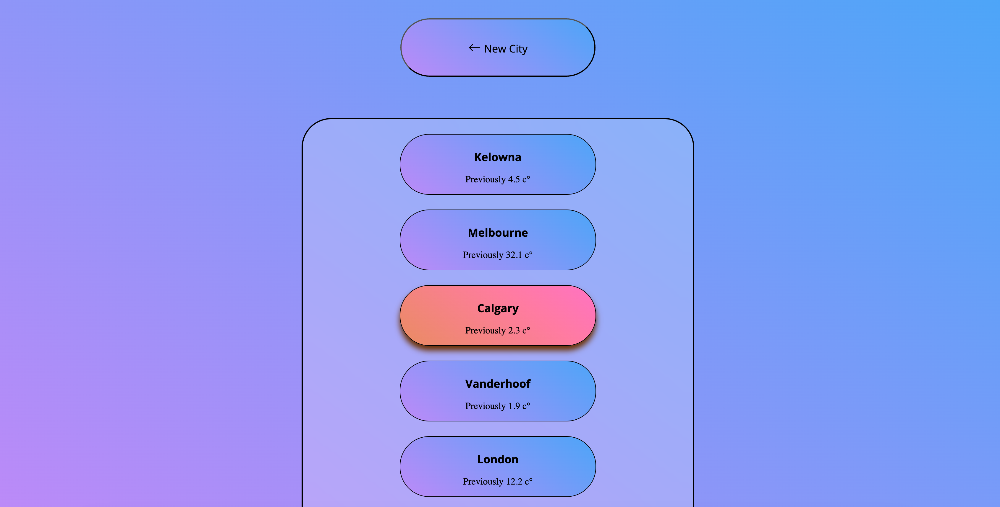
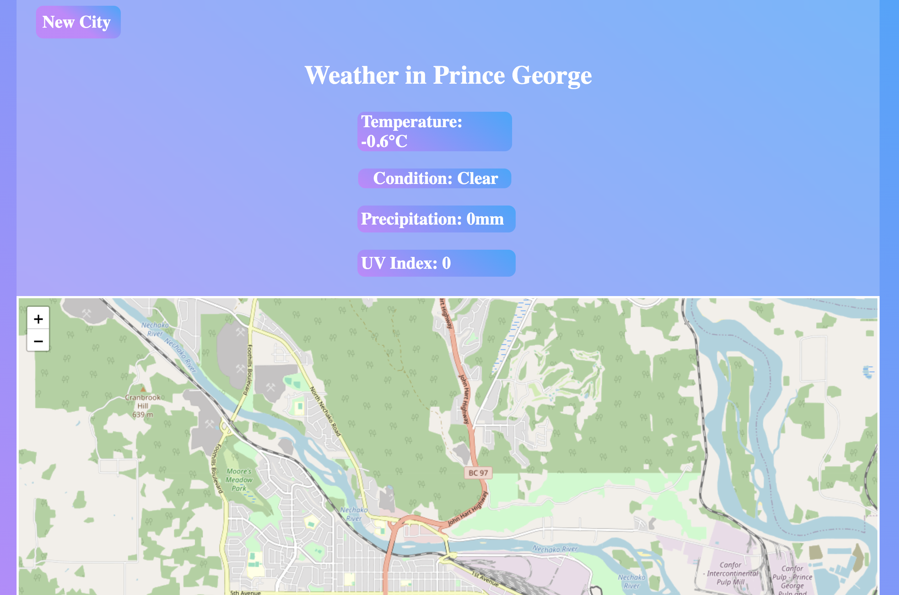

# NimbusWeathR

This weather website is a simple web app that allows users to search for any city and view its current weather conditions.
It's designed for anyone who wants quick and easy access to real-time weather updates. 
As my very first project as a software developer, it's also a personal milestone to practice working with APIs, JavaScript, and responsive design.

## Table of Contents

- [About](#about)
- [Features](#features)
- [Screenshots](#screenshots)
- [API Reference](#api-reference)
- [Wins and Difficulties Summary](#summary)

## About

NimbusWeathR is a web-based weather application designed to provide users with real-time weather updates for cities around the world. Whether you're planning your day or simply curious about the weather in different locations, NimbusWeathR offers a quick and easy way to access current weather conditions.

The app is designed with simplicity and functionality in mind. It allows users to input any city, retrieve up-to-date weather data, and view detailed information such as temperature, condition, and location. Additionally, NimbusWeathR keeps track of users' recent city searches, making it easy to revisit previously checked cities.

Built as a personal project and a milestone in my software development journey, NimbusWeathR has been a valuable exercise in working with APIs, JavaScript, responsive design, and local storage for session persistence.

## Features

- Displays real time weather!
- Temperature, UV Index, Precipitation, Condition!
- Users can view previous searches!
- Displays City's location!

## Screenshots

## API Reference

This project uses the [Free Weather API](https://www.weatherapi.com/) to fetch real-time weather data. It also fetches [Leafletmap](https://leafletjs.com/).

## Wins and Difficulties Summary

### Wins
Real-Time Weather Integration
Successfully implemented a functional weather application that retrieves accurate weather data using the WeatherAPI. The app supports dynamic input and returns live weather conditions for any searched city.

Effective State Management
Utilized sessionStorage and localStorage to persist city data across pages during the session. This allowed users to see both their latest weather searches and previously viewed cities.

Interactive UI
Created an intuitive user interface with clickable city cards that redirect users to a detailed weather display page. This enhanced user engagement and usability.

Modular Display Logic
Structured the application to dynamically update weather data based on the source (user input vs. city card click). This was achieved by conditionally rendering data from weatherData or selectedCity.

Robust Debugging and Refactoring
Addressed multiple functional bugs throughout development, such as data overwrites, duplicate city entries, and display errors.
Successfully resolved these through step-by-step debugging, consistent console logging, and logic restructuring.

### Difficulties
Issue: Display page showing all cities instead of the selected one
Resolution: Implemented conditional logic to prioritize selectedCity if present in session storage.

Issue: Duplicate entries in the cities array
Resolution: Replaced simple .includes() checks with .some() to perform a deeper comparison using city names.

Issue: Deployment discrepancies (works locally, not on GitHub Pages or hosted site)
Resolution: Identified file path case-sensitivity issues and considered alternatives to sessionStorage for persistent, cross-session functionality.

Issue: Fallback when navigating from different sources
Resolution: Added logic to determine navigation source and adjust rendering appropriately, ensuring consistent behavior whether a city is searched or selected.

### Summary
Throughout this project, careful attention was paid to user experience, data management, and maintainable code structure. 
The challenges encountered were typical of front-end JavaScript projects involving storage and API integration, but were systematically addressed through testing and refactoring. 
The final product is a responsive and interactive weather app that performs reliably across different user flows.

